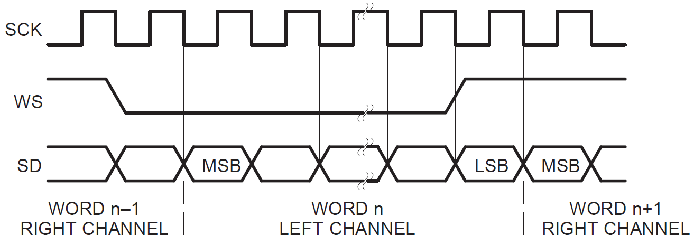

[Click here](../README.md) to view the README.

## Design and implementation

This design provides I2S controller implementation source files (*i2s_controller.c/h*) to implement the I2S controller (Tx only). It requires an SPI resource and smart I/O. All the initialization of these blocks are handled by the implementation source files. You need to configure only the clocks and pin assignment for the SPI and smart I/O.


### I2S interface overview

**Figure 1** shows the I2S interface timing diagram. It streams audio data for two channels: left and right. The Word Select (WS) signal indicates the channel that is currently streaming.

**Figure 1. I2S timing diagram (from I2S bus specification)**



Due to the similarities to the SPI interface, you can leverage the SPI controller to generate the clock (SCK) and the data signal (SD). The WS signal can be derived from the SPI-SS signal; however, it needs to keep toggling on every channel. In this implementation, the I2S channel length is 32 bits. Smart I/O is configured to toggle the WS signal every 32 cycles of SCK. It initially toggles when the SPI-SS signal asserts (beginning of transmission). Because the PSOC&trade; Edge SPI can support data width up to 16 bits only, the SPI FIFO needs to be written twice for every I2S channel.

**Table 1. SPI and I2S mapping**

SPI signal  |  I2S signal  | Description
------- | ------------  | ----
SCLK | TX_SCK (SCK) | Clock driven by the I2S controller
MOSI | TX_DATA (SD) | Data driven by the I2S controller
SS | TX_WS (WS) | transmission channel

<br>


### Clocking

The clock that drives the I2S/SPI depends on the required frame rate. Typical frame rate values are 8/16/22.05/32/44.1/48 kHz. The formula to calculate the clock frequency based on the required frame rate is as follows:

```math
Clock frequency [Hz] = (Frame_Rate [Hz]) * (2) * (Channel_Length) * (SPI_Oversample)
```

In this implementation, the channel length is fixed to 32 and the SPI oversample is fixed to 4.

Usually an audio codec requires a controller clock (CCLK). In this case, a PWM is used to generate CCLK. This clock is usually 256x faster than the frame rate (see the audio codec's datasheet).

**Table 2** shows a quick summary of frequencies to be configured in the system for a given frame rate:

**Table 2. SPI and I2S mapping**

Frame rate  |  I2S SCK  | SPI clock | CCLK | Peripheral clock
----------- | ----------| --------- | ---- | ---
8 kHz       | 0.512 MHz | 2.048 MHz | 2.048 MHz | 4.096 MHz
16 kHz      | 1.024 MHz | 4.096 MHz | 4.096 MHz | 16.384 MHz
22.05 kHz   | 1.4112 MHz | 5.6448 MHz | 5.6448 MHz | 22.5792 MHz
32 kHz      | 2.048 MHz | 8.192 MHz | 8.192 MHz | 32.768 MHz
44.1 kHz    | 2.822 MHz | 11.2896 MHz | 11.2896 MHz | 45.1584 MHz
48 kHz      | 3.072 MHz | 12.288 MHz | 12.288 MHz | 49.152 MHz

<br>

In this example, the PLL is configured to source the CPU clocks (HFCLK0) and be 3x the peripheral clock. This example uses the 16 kHz frame rate.


### Firmware overview

The firmware is designed to play a short audio record place in flash (*wave.h/c* file) when the kit's button is pressed.

The I2S controller init function requires an SPI resource and a smart I/O resource as arguments. The SPI resource is configured to generate an interrupt when the FIFO is half full. When the I2S controller write function is invoked, it writes data to the SPI FIFO until it is full. Once the FIFO level drops to half, it triggers the interrupt and more data is written to the FIFO. The firmware also registers a callback to be executed when the I2S Write operation finishes.

The smart I/O resource is configured to translate the SPI-SS to I2S-WS signal. It uses the internal look-up tables (LUTs) and data unit (DU) to count 32 cycles of the SPI-SCLK, and then toggle the I2S-WS output. It also delays the SPI-MOSI line to match the I2S bit arrangement.
<br>